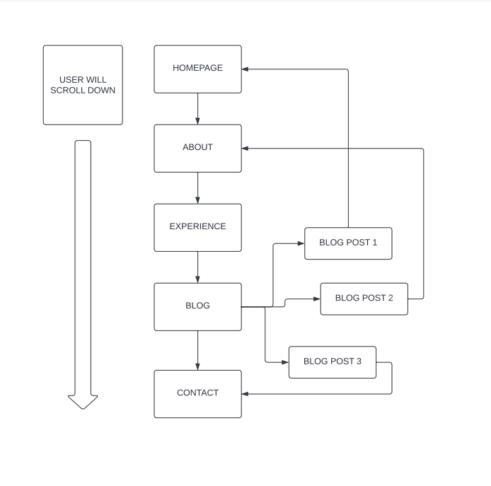

# Diego_portfolio

### overview and purpose

Welcome to my project portfolio, This readme file provides a brief overview of the various projects I have undertaken, showcasing my skills and expertise in the realm of software development and web aplications.

### Useful links

* Link to my [GitHub Repository] (https://github.com/poysongnocchi).

* Link to my deployed [website on Netify] (https://main--incomparable-valkyrie-9a87e8.netlify.app/)

* Link to my [Video presentation] (######)

## Functionality and Features

* The portfolio presents itself with a very minimalistic and classic style in black and white greyscale which I took inspiration from the apple's websites, very few colours are used to keep the user focus on what’s relevant and to deliver a clean, functional and profesional look.

* The portfolio layout presents all the different main sections displayed in one singular page that can be navigated scrolling down in order trough:
About, Experience, Blog and Contacts. Alternatively all section can be access through the navigation bar that upon input redirects the user to its related section of the same page utilising an html “Id=##” for each section improving user experience and navigation.

.png)

* My personal favourite function would be definitely the hamburger menu that is displayed when the viewport changes below 1200px, the hamburger menu is slightly animated a and is made using only html and css. The function of the hamburger menu is to solve the problem of space and functionality when the portfolio is visualising in small viewports.

* Through the portfolio various animations can be found like the loading of the experience bars in the experience section or the hoover selector when hovering trough buttons or blogposts all to enhance the user's experience through interaction with the page.

* Emojis are inserted throughout the webpage in each section using their equivalent Hexadecimal value in html, giving to the user a much more friendly experience without the need to use images.

## Sitemap

As mentioned abouve the portfoliio's layout makes all the different sections accessible in the same page through scrolling down with the exception of the blog section where interacting with each singular blog post will redirect the user to a single post page within a separate html file.
Inside the single blog post page the user will be able to navigate back to any section of the main page using the navigation bar on the header or the hamburger menu if on mobile devices.

## Target audience

When building this portfolio I consider making it accessible  snd appealing to a broad audience  while at the same time ensuring  that it communicates effectively my expertise and skills to potential employers or clients. Including a clear navigation  and a pleasant design were the main focus to give a positive impression to visitors from various backgrounds, who may include:

   * Potential employers:
     Hiring managers and recruiters looking for web developers.

   * Clients and freelance oportunities:
      Individuals or business in need of services.

   * Fellow developers:
     Individuals in the development field that want to collaborate on projects or share knwoledge.

   * Educators or students:
     Teachers or mentors in the web development field or students looking for examples or references.

   * Referals or networking:
       Proffessionals in my network or contacts that may refer me to potential oportunities.

 ## Tech stack

### For development
 

 

 ### For design

 

 ### For deployment

 

